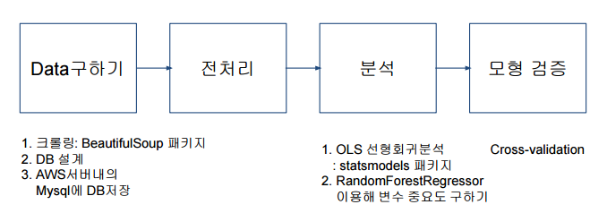

predict movie sales  
==========

- 투자자가 수입할 영화를 결정하는데 도움이 될만한 회귀 분석 모형을 만든다
- 분석에 사용할 독립 변수는, 영화 제작시점에서만 알 수 있는 정보로 제한
- 국내에서 흥행한 외화의 요소에 대해 알아보기  
 
 

Workflow
-

 
 

Dataset
-

- 2010년 이후 7년간 미국,한국에서 동시 개봉한 외화: 878편  
- 네이버 영화, BOX OFFICE MOJO 사이트 크롤링  
- 추가 작업: kaggle imdb 데이터로 nan값 채움  
- nan값이 없는 343편의 영화를 분석 대상으로 선정  

##### 독립 변수
---
 
             
 index      | 변수         |자료형         |변수 설명       |
-------------| -------------| -------------| -------------
1            | 장르          |Category      |19개의 카테고리 값     
2            | 관람 등급     | Category     |4개의 카테고리 값    |
3            |시리즈물       |Numeric       |전작 시리즈 영화 매출액의 합|
4            |영화 제작비    |Numeric       |달러       |
5            |감독 지수      |Numeric       |10년동안 국내에서 제작한 영화 매출액의 합|
6            |배우 지수      |Numeric       |5년동안 국내에서 출연한 영화 매출액의 합       |
7            |개봉계절        |Category       |4개의 카테고리 값 |

##### 종속 변수
---

  index      | 변수         |자료형         |변수 설명       |
-------------| -------------| -------------| -------------
1            | 국내 매출액   |Numeric      |달러       |  
 
 

  
Final Result
-
  

